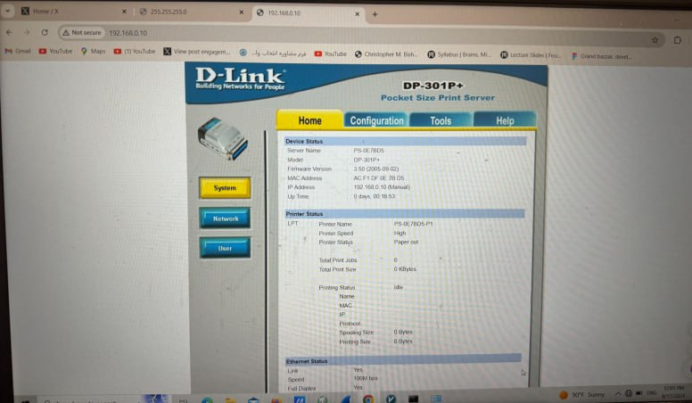

# Project Title

Analyzing device with parallel port

## Tools
- مبدل D-Link DE-620 
- Device with parallel port(printer hp laserjet 1200 series)

## Implementation Details

این پروژه به منظور یادگیری استفاده از مبدل -620DE Link-D و استفاده از آن به منظور برقراری ارتباط بین
کامپیوتری که پورت پارالل ندارد و دستگاهی که با پورت پارالل پیکربندی میشود است. دستگاهی که قرار بود آن را
پیکربندی کنیم، یک دستگاه صنعتی با کاربرد هایی در صنعت برق بود که متاسفانه نتوانستیم به این دستگاه دسترسی پیدا
کنیم. در ادامه به جای این دستگاه صنعتی، از یک پرینتر قدیمی با پورت پارالل استفاده شد.

 مطالعه و بررسی سیستم های نهفته در پزشکی، و به طور خاص کاربرد های آن در کمک به افراد ناتوان و
کم توان مخصوصا افراد دارای مشکالت در گفتار.
این مطالعه به سه بخش تقسیم شد:
-1 تحلیل و طبقه بندی داده ها و اطالعات موجود در این حوزه
-2 بررسی موارد کاربرد عملی سیستم های نهفته در توانبخشی
-3 شناسایی چالشها و ارائه پیشنهادات برای بهبود استفاده

## Results
Results are described in weekly reports and final report.
pictures:

## Related Links
Some links related to your project come here.
 - [Embedded Systems in Medical Devices](https://medium.com/@embeddedhash.in/embedded-systems-in-medical-devices-7f23fa0c01bc)
 - [Wearable Sensors ](https://www.mdpi.com/1424-8220/21/5/1858)
 - [Desgin Of Smart Wheelchair ](https://www.propulsiontechjournal.com/index.php/journal/article/view/388/312)
 - [مبدل D-Link DE-620 ](https://www.duali.com/en/product/reader/desktop-reader/de-620--de-620r/?ckattempt=1)

## Authors
Authors and their github link come here.
- [MohammadJavad Ahmadpour](https://github.com/ehsanino82)
- [Ehsan Rahmani](https://github.com/mohamadjavad83)
- [Amirali Rostami](https://github.com/amiralirostami)

